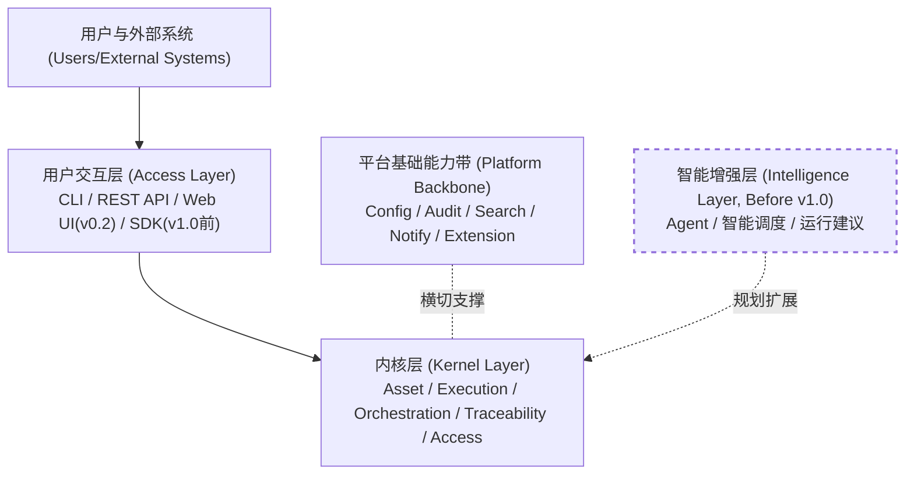
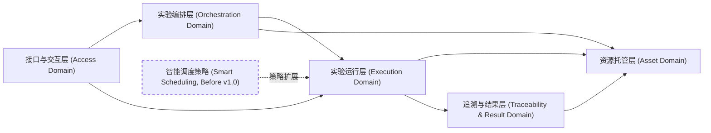
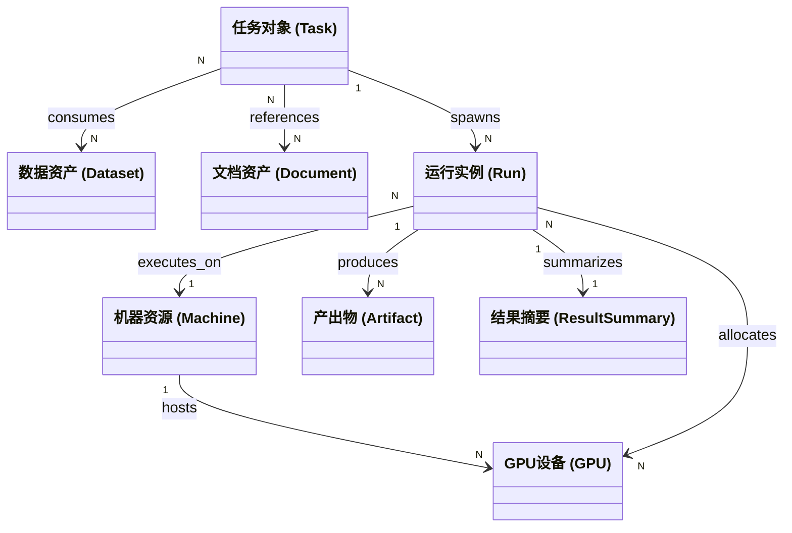
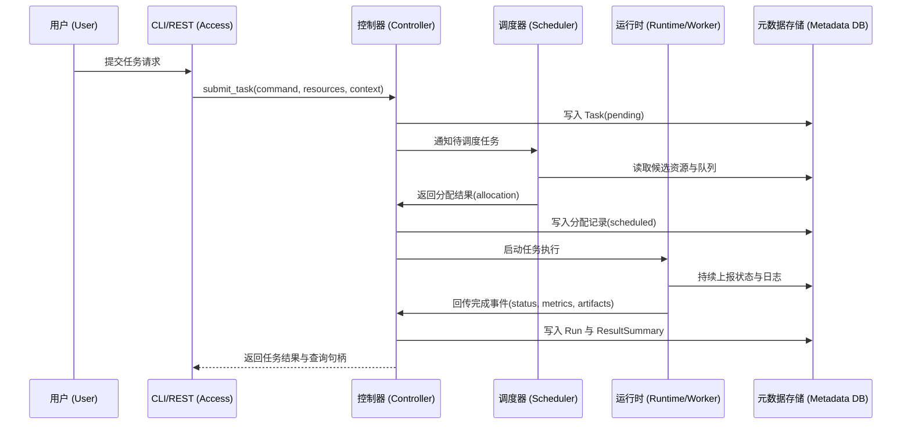
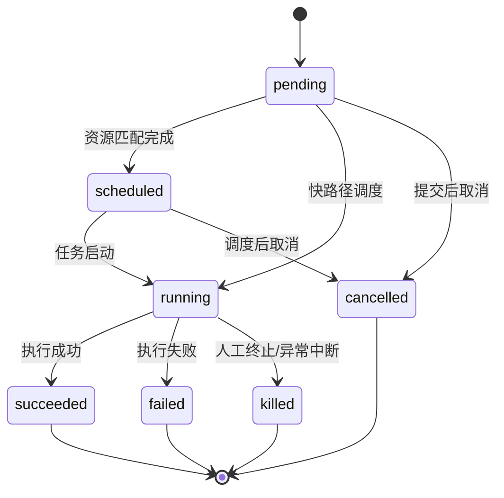
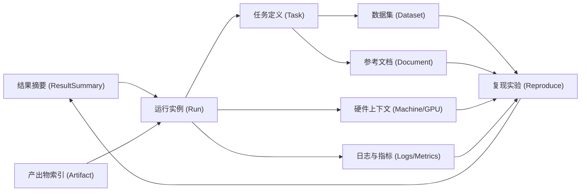

# Loom v0.1 架构分层设计

## 1. 文档目的

本文档用于定义 Loom v0.1 的总体架构分层、模块边界与职责划分，作为后续需求细化、数据模型设计、接口设计与实现落地的基础。

v0.1 的目标不是一次性做成完整平台，而是在保证结构清晰、模型稳定、可向后扩展的前提下，做出一个最小可用版本（MVP），能够在实验室环境中实际运行。

---

## 2. 系统定位

Loom 的定位是：

**面向深度学习实验室的统一资产与实验运营平台。**

它不是单纯的任务调度工具，也不是单纯的数据管理系统，而是围绕实验室的实际研发流程，解决以下三个核心问题：

- 资产分散，缺乏统一登记与关联
- 实验流程混乱，依赖手工提交与人工协调
- 结果不可追溯，难以从结果反查输入与上下文，复现完全一样环境困难

系统长期目标包括：

- 资产统一建模
- 实验执行标准化
- 全链路可追溯
- 保持可扩展架构，支撑后续调度策略、实验模板、Web UI、Java control plane、分布式能力与智能分析能力扩展

---

## 3. v0.1 架构原则

Loom v0.1 采用以下基本原则：

### 3.1 元数据优先
系统优先管理资产的元数据、路径、引用关系与上下文来增强索引，同时需要支持直接托管全部文件本体。

### 3.2 一切围绕可追溯
系统中的所有托管资产（任务、运行、结果）都必须可以被追溯，能够通过系统完整还原当时环境
### 3.3 向后兼容
确保项目可迭代，向后兼容

---

## 4. 总体架构概览

Loom 的总体架构可抽象为：

**以资产中心为底座，以实验运行为主线，以结果追溯为闭环，以 CLI/Web/API 为入口，以智能增强为远期扩展。**

***v0.1主要分为内核层和交互层两层，内核层提供核心的任务实现，交互层提供CLI,Web,SDK的外部接口，两者通过调用内核层接口进行统一封装和调用***

定位声明（关键澄清）：

- 内核层是 framework-agnostic 的核心能力层，负责统一能力抽象与业务不变量，不与某个 Web 框架绑定。
- 交互层负责对外协议与壳层实现（CLI/REST/Web/SDK），调用内核能力并封装外部入口。
- v0.1 当前原型阶段采用 FastAPI 进行框架设计与落地，主要用于控制器/交互侧桥接，不改变内核框架无关定位。

从分层上，Loom 可拆分为六层：

1. 资产托管层（Asset Domain）
2. 实验运行层（Execution Domain）
3. 实验编排层（Experiment Orchestration Domain）
4. 追溯与结果层（Traceability & Result Domain）
5. 接口与交互层（Access Layer）
6. 智能增强层（Intelligence Layer，远期）

此外，还存在一条横切的平台基础能力带，用于承载配置、审计、检索、通知、扩展机制等共性能力。

图目的说明：展示 Loom 在 v0.1 的主分层、调用入口与远期能力演进位置。

解读要点：

- v0.1 的主路径是 `用户/系统 -> 交互层 -> 内核层`，这是当前必须稳定的交付链路。
- 平台基础能力带是横切能力，不替代业务主链路，但为审计、配置和扩展提供统一底座。
- 智能增强层（含 Agent/智能调度）以虚线表示“v1.0 前规划”，不改变 v0.1 运行闭环。
- v0.1 使用 FastAPI 原型化交互/控制侧，但内核边界保持 framework-agnostic。

图目的说明：展示内核 5 个域的边界与主要依赖方向，明确哪些关系可直接调用。

解读要点：

- 编排层与运行层共同驱动任务执行；资源托管层提供统一资产上下文与索引基础。
- 追溯结果层消费运行与资产信息，形成“结果可反查输入”的闭环能力。
- 智能调度策略作为策略扩展点挂在运行层，不破坏当前 v0.1 的基础调度实现。

---

## 5. 架构分层详解

***v0.1主要分为内核层和交互层两层，内核层提供核心的任务实现，交互层提供CLI,Web,SDK的外部接口，两者通过调用内核层接口进行统一封装和调用***

---

### 内核层

#### 5.1资源托管层

职责：内核层确保元数据的日志级别管理，也就是每一次元数据更改变动都可被追溯，但是对实际存储对象在v0.1版本只提供追溯功能

管理对象：管理实验室所有资产，以统一的结构进行存储和索引

> 硬件资产（机器配置）
>
> 数据资产（数据集）
>
> 环境资产（运行当中使用的环境）
>
> 运行资产（每一次实际运行的模型文件，脚本等等）
>
> 文档资产（参考文献）（项目日志）
>
> 结果资产（模型权重，训练日志）
>
> 

核心职责：

- 统一登记实验室资产
- 维护资产元信息
- 建立资产之间的引用关系
- 为任务与实验提供输入上下文
- 为检索与追溯提供基础索引

这一层回答的问题

- 实验室有哪些资产
- 每个资产位于哪里
- 哪些资产彼此相关
- 哪些任务使用过某个资产

图目的说明：展示资产域与任务执行结果之间的核心实体关系，用于定义追溯最小闭环。

解读要点：

- `Task -> Run -> Artifact/ResultSummary` 是结果闭环的主链，保证“从任务到产出”可落地。
- `Task` 与 `Dataset/Document` 的多对多关系体现实验上下文与参考来源。
- `Run` 与 `Machine/GPU` 的绑定是资源审计和复现实验环境的关键。

---

#### 5.2 实验运行层（Execution Domain）

5.2.1 职责

实验运行层是 Loom 的核心主线，负责把“手工启动实验”转化为“系统化提交、调度、执行与回传”。它需要对实验编排层提供向上接口。

5.2.2 核心对象

- Task
- Scheduler
- Queue
- Run

5.2.3 核心流程

在 v0.1 中，实验运行层的主流程应当固定为：

1. 用户提交 Task
2. Task 进入 Queue 的pending队列
3. Scheduler 按资源条件匹配机器和 GPU
4. Controller 生成分配记录
5. Scheduler 拉起任务执行
6. Scheduler 上报状态、日志、结束信息
7. Controller 生成 Run 与结果记录

图目的说明：展示从 Task 提交到 Run 产出的端到端时序，明确控制面与执行面的责任分界。

解读要点：

- Controller 负责元数据一致性与生命周期落库，Scheduler 聚焦资源匹配决策。
- Runtime 只负责执行与回传，不承载编排决策，职责边界清晰。
- DB 是追溯真相源，任务状态、日志索引与结果摘要全部以其为准。

5.2.4 任务状态机

v0.1 的最小状态集合为：

- pending
- running
- succeeded
- failed
- killed

- scheduled
- cancelled

图目的说明：展示任务状态迁移规则，并标注 v0.1 与扩展状态的关系。

解读要点：

- `pending/running/succeeded/failed/killed` 是 v0.1 必须稳定支持的最小状态集合。
- `scheduled/cancelled` 是流程完整性状态，便于后续扩展审计与运营可见性。
- 通过显式状态迁移，避免“隐式完成/隐式失败”造成追溯断链。

5.2.5 v0.1 范围

v0.1 只支持：

- 基于 GPU 数量和显存、计算能力的资源匹配
- FIFO 队列或者其它队列的简单调度
- 基础任务生命周期管理
- 基础日志与状态上报

预计将来支持的内容：

- 抢占式调度
- 多租户复杂公平策略
- 容器编排
- 分布式训练编排
- 复杂工作流 DAG
- agent智能调度

---

#### 5.3 实验编排层（Experiment Orchestration Domain）

5.3.1 职责

实验室真正关心的不是单条 shell 命令，而是一个完整的实验上下文。

因此，除了 Task 之外，系统还需要更高一层的实验编排抽象，用于承载“为什么要跑、用什么跑、属于哪一组实验”。

***承担一定程度上的日志记录功能，为结果和追溯层提供接口***

5.3.2 核心概念

课题组：属于哪一个课题组（对应某位导师带领的团队）

实验组：属于哪一课题组下哪组实验（打个比方，比如分牙，对于具体某一篇要产出的论文）

任务组：属于哪组实验的哪一个任务（打个比方，调参任务，对应论文某一章节要解决的问题）

5.3.4 这一层的作用

它是从“任务调度器”升级到“实验系统”的关键层。

它契合国内课题组对论文产出的要求

没有这一层，Loom 只能管理任务；
有了这一层，Loom 才能管理实验。

#### 5.4 追溯与结果层（Traceability & Result Domain）

5.4.1 职责

追溯与结果层负责把“实验用了什么”和“最终产出了什么”连接成完整链路。

这是 Loom 的核心价值之一。

5.4.2 目标

系统必须支持从任何结果反查：

- 所属任务

- 使用数据集

- 所属硬件
- 所属实验组、论文组、课题组
- 相关产出内容

图目的说明：展示“结果 -> 输入/环境 -> 可复现运行”的追溯闭环。

解读要点：

- 追溯入口既可以是 `ResultSummary`，也可以是 `Artifact`，最终都回到 `Run/Task`。
- 数据、文档、硬件、日志四类上下文共同构成“可复现证据链”。
- 闭环最终回指结果，支持“验证复现结果与原结果一致性”的研发流程。

---

#### 5.5 接口与交互层（Access Layer）

5.5.1 职责

接口与交互层负责将 Loom 内核层的能力暴露给用户交互层进行调用，并且制定规范文档，提供给第三方开发者自行开发对应的壳。

5.5.2 实现声明（v0.1）

- 内核对上暴露统一能力接口（命令/查询能力），供 CLI/SDK/Web 后端复用。
- Web 后端在 v0.1 原型中使用 FastAPI 作为桥接实现，负责前端协议接入、序列化、鉴权和扩展业务接口。
- FastAPI 的使用属于交互层实现选择，不等价于“内核由 FastAPI 定义”。

-----

### 用户交互层

用户交互层作为一个官方提供的可直接部署的用户操作界面，提供三种交互方式，包括CLI接口，WebUI（配套api接口），SDK三种方式供外部调用，其中，RestAPI会被优先开发，随后是CLI，在v0.1版本当中不提供SDK，在v0.2版本当中提供WebUI，我们承诺在v1.0之前提供SDK。

